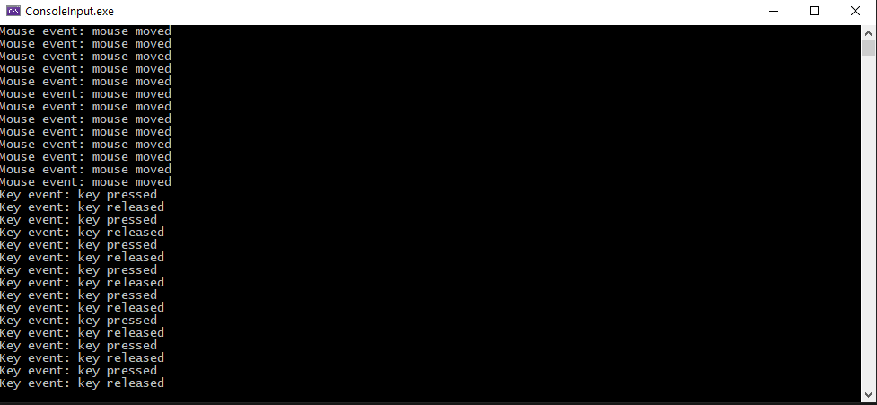

Usually console applications are not associated with interactivity. Most of console apps accept some parameters via command line, do their job and exit. If the interactivity is needed, one has an option to build simple letters-controlled menu. While it is OK for simple applications, it is not enough for interactive applications. An alternative would be to create windowed application, which has richer keyboard and mouse control functionality out-of-the-box. But what to do if you want to stick with console application? Windows can enable your app to receive direct events related to mouse and keyboard sent to your console window.

* * *

The function that does the job is ReadConsoleInput. It does access to console's windows input buffer. Each time a console window is created, direct keyboard and mouse inputs are disabled. To ensure that the window receives all types of input events, the following code example uses the SetConsoleMode API to enable keyboard and mouse input. Main loop reads 500 input events. When the user presses a key, the console shows "Keyboard event" message. When the user moves or clicks the mouse, the "Mouse event" message is displayed.

